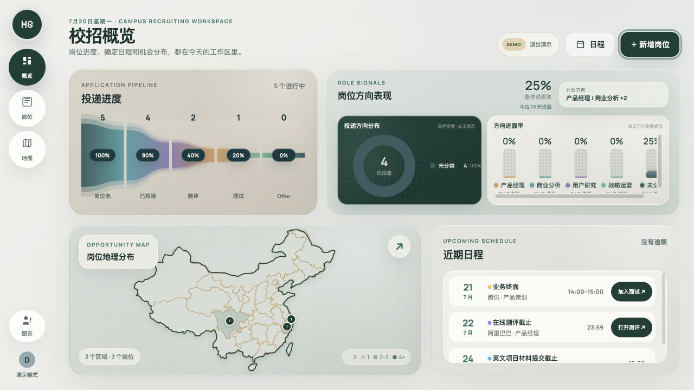
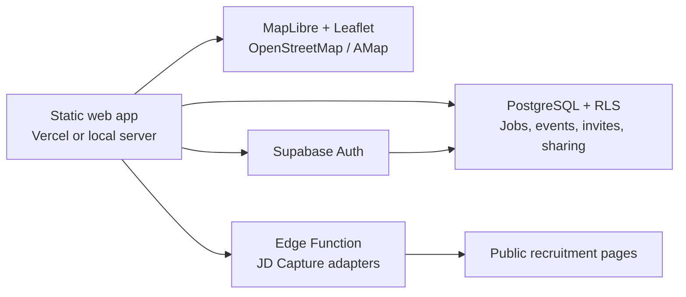

# HyperGrad

> A privacy-first campus recruiting workspace for applications, deadlines, interview links, office locations, commute research, and hiring progress.

[Live product](https://hypergrad-campus-hiring-dashboard.vercel.app) · [Try the no-login demo](https://hypergrad-campus-hiring-dashboard.vercel.app) · [中文说明](./使用说明.md)



HyperGrad turns a fragmented campus recruiting season into one focused workflow. It combines an application pipeline, confirmed schedule, role analytics, city-level opportunity map, office-level research, route planning, and privacy-trimmed friend locations in a single dashboard.

The public demo is an isolated in-memory sandbox: it does not require an account, write to Supabase, overwrite browser data, or publish friend locations.

## Why this exists

Campus recruiting information is usually split across spreadsheets, calendar reminders, recruitment portals, map searches, chat messages, and interview links. The hard part is not storing another row—it is keeping the next deadline visible while comparing role fit, progress, location, and commute trade-offs.

HyperGrad is designed around that decision loop:

1. Capture a job from a public recruitment link or pasted JD.
2. Confirm the role direction, Base city, office candidate, and application stage.
3. Record only objective schedule nodes such as assessments, interviews, submissions, and Offer deadlines.
4. Review pipeline and role signals on the overview.
5. Open Map Research when office location or commute becomes part of the decision.

## Product highlights

- **Application workspace** — track stages, role directions, preferences, priorities, JD snapshots, and objective schedule nodes.
- **Agent capture queue** — newly captured roles enter a dedicated screening stage before they join the manual application pipeline.
- **JD Capture** — extract company, role, Base, direction, and deadline from supported public recruitment pages; every result is reviewed before saving.
- **Schedule** — combine assessments, interviews, material deadlines, meeting links, and Offer response dates.
- **Role signals** — compare direction distribution, interview conversion, and response-time signals.
- **Map Research** — city clusters, precise office points, friend aliases, transit itineraries, and driving routes.
- **Privacy-aware sharing** — friends see an alias, city, and point only; company, role, stage, building, and schedule remain private.
- **Invite-gated cloud accounts** — Supabase Auth, PostgreSQL, Row Level Security, and administrator-managed invite codes.
- **No-login demo** — a disposable sandbox with representative data for reviewers and contributors.

## Architecture



The frontend is framework-free JavaScript and CSS. Cloud features are optional: without Supabase configuration, the app remains usable as a local workspace.

## Quick start

Requirements: Python 3.10+ for the local static server, or Node.js 20+ for the production build.

```bash
git clone https://github.com/dufunn/hypergrad.git
cd hypergrad
python3 server.py --open
```

Open `http://127.0.0.1:4175`. No API key is required for the no-login demo and basic local workflow.

Optional local integrations:

```bash
cp amap-config.example.js amap-config.local.js
cp supabase-config.example.js supabase-config.local.js
```

Use only a browser-safe Supabase publishable/anon key. Never place a `service_role` key in frontend configuration.

## Build and test

```bash
npm run check
```

The check builds the deployable `dist/` directory and runs provider/parser regression tests for JD Capture.

## Self-hosting

The reference deployment uses Vercel for static hosting and Supabase for Auth, PostgreSQL, RLS, and Edge Functions. See [DEPLOY.md](./DEPLOY.md) for the complete setup, including:

- database schema and migrations;
- the first platform administrator;
- the registration hook for invite codes;
- JD Capture Edge Function deployment;
- Vercel environment variables;
- AMap domain restrictions.

## Security and privacy

- User jobs and schedules are protected by PostgreSQL Row Level Security.
- The browser never receives a Supabase `service_role` key.
- Friend sharing returns a deliberately reduced point payload.
- JD Capture requires an authenticated request, supports an origin allowlist and best-effort per-instance rate limit, limits source size and redirects, and blocks common local/private hosts.
- Imported recruitment data is always treated as a suggestion and confirmed by the user.

Please report vulnerabilities through GitHub private vulnerability reporting as described in [SECURITY.md](./SECURITY.md).

## Project status

HyperGrad is a working product and an actively evolving portfolio project. Near-term engineering work includes splitting the current frontend into domain modules, expanding browser-level tests, and adding more recruitment-provider adapters without turning JD Capture into a bulk scraper.

## Contributing

Issues and focused pull requests are welcome. Read [CONTRIBUTING.md](./CONTRIBUTING.md), [CODE_OF_CONDUCT.md](./CODE_OF_CONDUCT.md), and [THIRD_PARTY_NOTICES.md](./THIRD_PARTY_NOTICES.md) first.

## License

The original HyperGrad source code is released under the [MIT License](./LICENSE). Third-party datasets, map tiles, fonts, APIs, and media keep their own terms and are listed separately in [THIRD_PARTY_NOTICES.md](./THIRD_PARTY_NOTICES.md).
